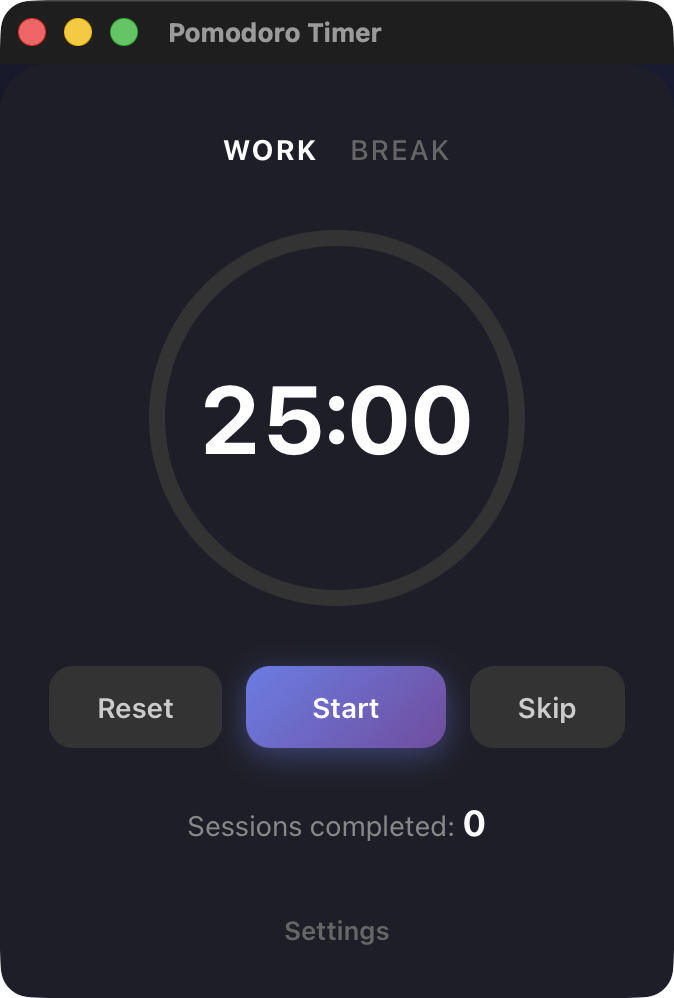

<p align="center">
  
</p>

<h1 align="center">Pomodoro Timer</h1>

<p align="center">
  A clean, minimal Pomodoro timer desktop app built with Tauri and React.
</p>

<p align="center">
  
  
  
  
  
  
</p>

---

## Features

- **Work/Break modes** with visual indicator
- **Circular progress ring** (red for work, green for break)
- **Configurable durations** for work and break sessions
- **Session counter** to track completed pomodoros
- **Sound notification** when timer ends
- **Dark mode** support (follows system preference)
- **Lightweight** (~5MB app size)

## Quick Start

```bash
# Install dependencies
npm install

# Run in development mode
npm run tauri dev

# Build for production
npm run tauri build
```

## Requirements

- Node.js 18+
- Rust (install via [rustup](https://rustup.rs))
- Platform-specific dependencies:
  - **macOS**: Xcode Command Line Tools
  - **Windows**: Microsoft Visual Studio C++ Build Tools, WebView2
  - **Linux**: `webkit2gtk`, `libappindicator`

## Build Output

After running `npm run tauri build`:

| Platform | Output |
|----------|--------|
| macOS | `src-tauri/target/release/bundle/macos/Pomodoro.app` |
| macOS | `src-tauri/target/release/bundle/dmg/Pomodoro_*.dmg` |
| Windows | `src-tauri/target/release/bundle/msi/Pomodoro_*.msi` |
| Linux | `src-tauri/target/release/bundle/deb/pomodoro_*.deb` |

## Tech Stack

- **Frontend**: React 19, TypeScript, Vite
- **Backend**: Tauri 2, Rust
- **Styling**: CSS with dark mode support

## Project Structure

```
src/
  App.tsx       # Main component with timer logic
  App.css       # Styling
src-tauri/
  src/          # Rust backend
  tauri.conf.json   # App configuration
```

## License

MIT
